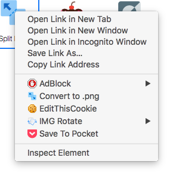

SVG2PNG
========

A simple Chrome plugin which converts a \<svg\> element from a webpage to a .png file.
 

Features:

- Allows you to choose your file name for every single conversion.
- Automatically generates retina size files (1x, 2x and 3x).
- Built-in right within your context menu for easy access.

Installation
--------
You can get it here: [https://chrome.google.com/webstore/detail/inevent/mjmflhaljgohpgdciblbbgkldlpclajd](https://chrome.google.com/webstore/detail/inevent/mjmflhaljgohpgdciblbbgkldlpclajd)

Support
--------
Just open an issue on Github and we'll get to it as soon as possible.

About
--------
Created and mantained by Pedro Góes.